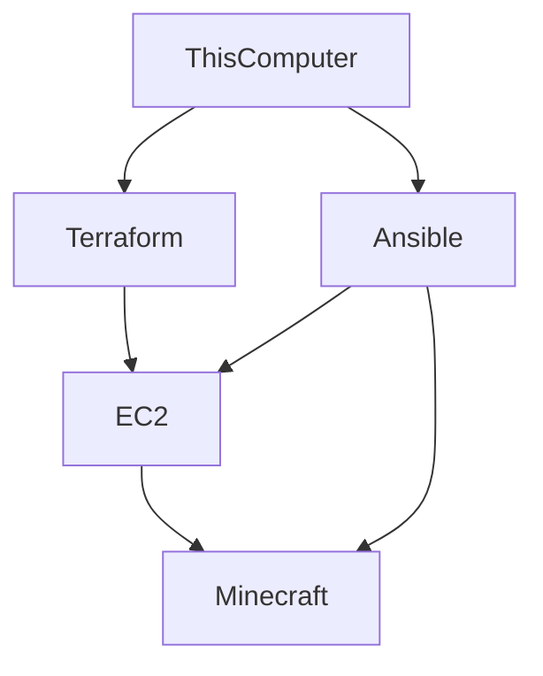

# CS-312 Project 2
# Background:
- Note: This repo assumes you're running linux, these instructions will not work for Microsoft Windows

The focus of this repo is to provide 

# Requirements:
- Ansible* (tested on version 2.10.8)
- Terraform* (tested on v1.8.4)

> *Note: These tools will be installed in this guide

- An AWS account
- Money for your AWS account

> This guide assumes you're on Ubuntu (this was tested on Ubuntu 22.04 & 24.04)

# How to Provision AWS:

1. First We'll want to clone this repo, you can do that by issuing the command `cd ~/Documents && git clone https://github.com/SandFrog/cs312project2.git && cd cs312project2` to get started.
2.  Next we'll need to `chmod +x ./setup.sh` in order allow execution of the setup script.
3. Now we can run `./setup.sh` in order to install the required tools.

> Note: Please read through these scripts, don't just trust some bash script someone put on the internet!

4. Run the command `ssh-keygen`. Once it asks you for a name, enter `minecraft` the other entries can be left blank.
5. Copy your AWS credentials into `~/.aws/credentials`
6. Run the commands `terraform init` and `terraform apply` in order to provision our machine with AWS.
7. Run the command `

# How to Provision Your Machine:
# Resources Used:
- For how to set up security groups: https://registry.terraform.io/providers/hashicorp/aws/latest/docs/resources/security_group.html
- For how to output the IP of the instance:
https://developer.hashicorp.com/terraform/tutorials/aws-get-started/aws-outputs