# CS-312 Project 2
# Background:
> This repo assumes you're running Ubuntu, these instructions may work for other distros with minor changes. These instructions will not work for Microsoft Windows. (This guide has been tested on Ubuntu 22.04 & 24.04)

This repo sets up an EC2 instance through Terraform, and then uses Ansible to establish a Minecraft server through the EC2 instance.

```mermaid
graph TD;
    A[Your Computer 😎]-->Terraform;
    A[Your Computer 😎]-->Ansible;
    Terraform-->EC2;
    Ansible-->EC2;
    EC2-->Minecraft;
    Ansible-->Minecraft;
```

# Requirements:
- [Ansible](https://docs.ansible.com/ansible/latest/installation_guide/intro_installation.html)* (tested on version 2.10.8)
- [Terraform](https://developer.hashicorp.com/terraform/install)* (tested on v1.8.4)

> *Note: These tools will be installed in this guide

- An AWS account
- Money for your AWS account

## How to Setup Our Computer:

1. First We'll want to clone this repo, you can do that by issuing the command `cd ~/Documents && git clone https://github.com/SandFrog/cs312project2.git && cd cs312project2`.
2.  Next we'll need to `chmod +x ./setup.sh` in order allow execution of the setup script.
3. Now we can run `./setup.sh` in order to install the required tools.

> Note: Please read through these scripts, don't just trust some bash script someone put on the internet!

4. Run the command `ssh-keygen`. Once it asks you for a name, enter `minecraft` the other entries can be left blank.
5. Copy your AWS credentials into `~/.aws/credentials`

## How to Provision Our EC2 Instance: 
Now that our computer is set up, we'll need to create our EC2 with Terraform and set up our Minecraft server with Ansible.

1. Run the commands `terraform init` and `terraform apply` in order to provision our machine with AWS.
2. The apply command should output the public IP of our new EC2 instance, we'll need to add that to our Ansible config, change the file with `sudo nano /etc/ansible/hosts`. Replace `YOURIPHERE` with the IP of the instance.
3. Now we can use Ansible to set up our server with the command `ansible-playbook playbook.yml`. This will take a minute!
4. You should be set, enjoy your new Minecraft server!

# Resources Used:
- [Terraform tutorial](https://developer.hashicorp.com/terraform/tutorials/aws-get-started/aws-build)
- [Resource on security groups](https://registry.terraform.io/providers/hashicorp/aws/latest/docs/resources/security_group.html)
- [How to output a public IP](https://developer.hashicorp.com/terraform/tutorials/aws-get-started/aws-outputs)
- [General Ansible documentation](https://docs.ansible.com/)